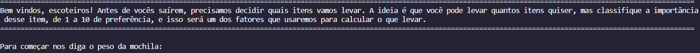
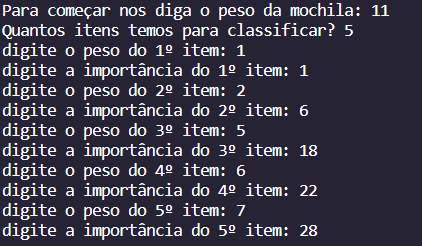
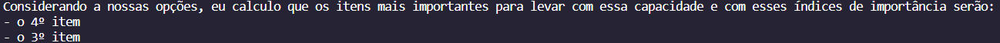

# PD_Acampamento

**Número da Lista**: 2 
**Conteúdo da Disciplina**: Progamação Dinâmica 

## Alunos
|Matrícula | Aluno |
| -- | -- |
| 19/0032821  | Lorenzo de Lima Alves dos Santos |

## Sobre 
Este projeto aplica o algoritmo de Knapsack de forma dinâmica para calcular quais itens é melhor levar em um acampaento, cosiderando a importância de cada item como seu valor.

## Screenshots
Adicione 3 ou mais screenshots do projeto em funcionamento.

## Instalação 
**Linguagem**: Python 
É recomendado usar o VS code para executar esse programa, mas outras IDEs com extensão para python também devem ser capaz de executar esse código.

## Uso 
Basta executar o código direto pela sua IDE de preferência, diga o tamanho da mochila, quantos itens e qual a importância de cada item, e o código irá dizer qual a melhor combinação de itens que maximize o uso de espaço e com a maior importância combinada possível.

